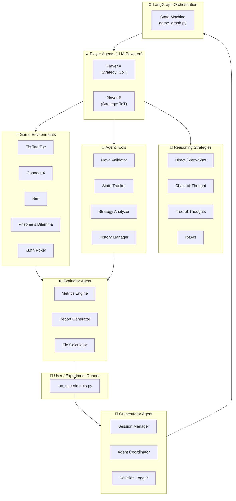
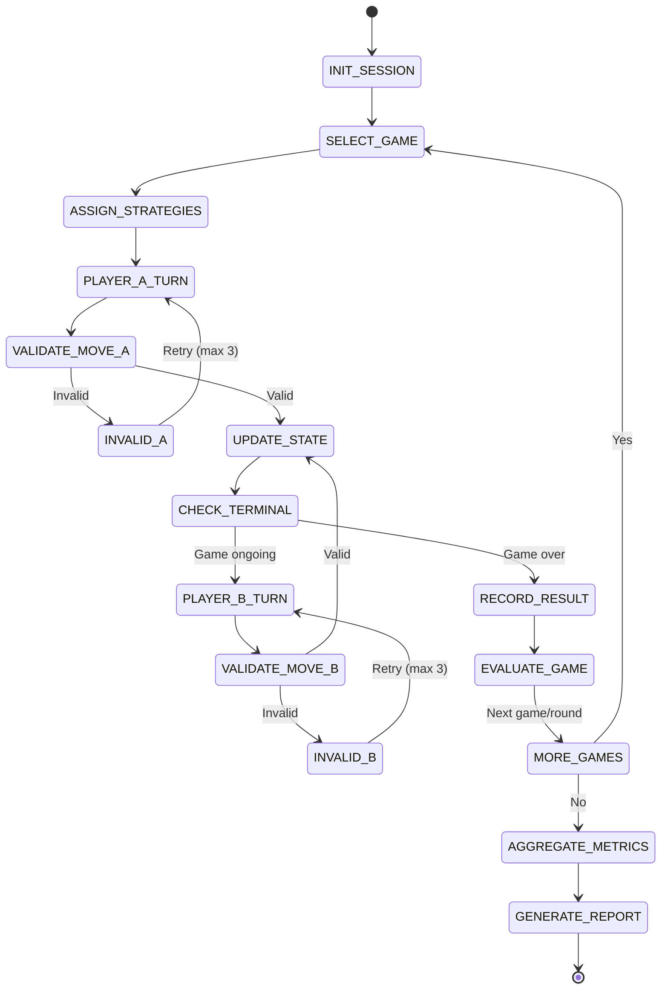

# 🎮 Agentic GTBench: LLM Strategic Reasoning via Multi-Agent Game-Theoretic Evaluation

> **FAST NUCES — Agentic AI Final Project**  
> Manal Aamir (22I-1940) · Aqsa Fayaz (22i-1865) · Arhum Khan (22i-1967)  
> Department of Data Science

---

## 📌 Project Overview

This project implements a **fully autonomous multi-agent system** that evaluates and compares the strategic reasoning capabilities of Large Language Models (LLMs) through game-theoretic environments. Extending the GTBench framework, we build a real **Agentic AI** where:

- **Autonomous LLM agents** compete across 5 classical games
- **Multiple reasoning strategies** (Direct, CoT, ToT, ReAct) are tested head-to-head
- A **dedicated Orchestrator Agent** manages sessions, coordinates players, and logs decisions
- An **Evaluator Agent** computes metrics, detects strategy patterns, and generates reports
- All communication flows through a **LangGraph state machine**

---

## 🗂️ Repository Structure

```
agentic-gtbench/
├── agents/
│   ├── base_agent.py           # Abstract LLM agent interface
│   ├── player_agent.py         # Game-playing agent with strategy injection
│   ├── orchestrator_agent.py   # Session manager & coordinator
│   ├── evaluator_agent.py      # Metric collector & result analyzer
│   └── strategies/
│       ├── direct.py           # Zero-shot prompting
│       ├── cot.py              # Chain-of-Thought
│       ├── tot.py              # Tree-of-Thoughts
│       └── react.py            # ReAct (Reason + Act)
├── games/
│   ├── base_game.py            # Abstract game interface
│   ├── tictactoe.py            # Complete-info, deterministic
│   ├── connect4.py             # Complete-info, deterministic
│   ├── nim.py                  # Perfect-info combinatorial
│   ├── prisoners_dilemma.py    # Repeated / iterated game
│   └── kuhn_poker.py           # Incomplete-info, probabilistic
├── tools/
│   ├── move_validator.py       # Legal move enforcement tool
│   ├── state_tracker.py        # Game state serialization tool
│   ├── strategy_analyzer.py    # Opponent modeling tool
│   └── history_manager.py      # Persistent game history tool
├── orchestration/
│   └── game_graph.py           # LangGraph workflow definition
├── evaluation/
│   ├── metrics.py              # Win rate, invalid rate, Elo, Pareto
│   └── reporter.py             # CSV/JSON/HTML result export
├── experiments/
│   ├── run_experiments.py      # Main experiment runner
│   └── configs/
│       ├── exp1_reasoning.yaml   # Strategy comparison (same model, vary strategy)
│       ├── exp2_models.yaml      # Model comparison via OpenRouter slugs
│       ├── exp3_gemma_openrouter.yaml  # Gemma 12B vs Gemma 3n (OpenRouter)
│       └── exp4_gemma_12b_vs_27b.yaml # Gemma 12B vs 27B head-to-head
├── config/
│   └── settings.py             # Central config & env loading
├── tests/
│   ├── test_games.py
│   ├── test_agents.py
│   └── test_evaluation.py
├── diagrams/
│   ├── system_architecture.md  # Mermaid: full system diagram
│   └── agent_workflow.md       # Mermaid: LangGraph state flow
├── results/                    # Auto-generated experiment outputs
├── requirements.txt
├── .env.example
└── IMPLEMENTATION_PLAN.md      # Step-by-step dev guide for Cursor
```

---

## 🏗️ System Architecture



---

## 🔄 LangGraph State Flow



---

## 🎯 Gaps Addressed Beyond GTBench Paper

| Gap in Review Paper | Our Implementation Fix |
|---|---|
| No actual agent implementation | Full LangGraph multi-agent system |
| Only reviews prompting — no testing | Live head-to-head strategy tournaments |
| No tool use / API integration | 4 dedicated agent tools built |
| No multi-agent coordination | Orchestrator + Player + Evaluator agents |
| No evaluation framework | Elo ratings, win rates, invalid move %, Pareto efficiency |
| No dynamic/adaptive behavior | Opponent modeling via Strategy Analyzer tool |
| No persistence or memory | History Manager with JSON logs |
| Single reasoning path | All 4 strategies selectable per agent |

---

## ⚙️ Setup & Installation

### Prerequisites
- Python 3.10+
- OpenRouter API key (recommended: one key for OpenAI-, Meta-, and Google-routed models), or direct OpenAI / Groq keys if you use those providers in configs
- Git

### 1. Clone the Repository
```bash
git clone https://github.com/Aqsa-Fayaz/Agentic-gtbench.git
cd Agentic-gtbench
```

### 2. Create Virtual Environment
```bash
python -m venv venv
source venv/bin/activate        # Linux/Mac
venv\Scripts\activate           # Windows
```

### 3. Install Dependencies
```bash
pip install -r requirements.txt
```

### 4. Configure Environment
```bash
cp .env.example .env
# Edit .env and add your API keys
```

### 5. Run a Quick Test
```bash
python -m pytest tests/ -v
```

### 6. Run Experiments
```bash
# Strategy comparison experiment
python experiments/run_experiments.py --config experiments/configs/exp1_reasoning.yaml

# Model comparison (OpenRouter model IDs, e.g. openai/gpt-4o, meta-llama/...)
python experiments/run_experiments.py --config experiments/configs/exp2_models.yaml

# Gemma on OpenRouter (example matchup)
python experiments/run_experiments.py --config experiments/configs/exp3_gemma_openrouter.yaml

# Gemma 12B vs 27B (poster baseline)
python experiments/run_experiments.py --config experiments/configs/exp4_gemma_12b_vs_27b.yaml
```

Outputs are written under `results/<ExperimentName>_<timestamp>/` as `report.json`, `sessions.csv`, and `report.html`. View the HTML locally:

```bash
cd results/<your_run_folder>
python -m http.server 8000
# open http://127.0.0.1:8000/report.html
```

**LangGraph:** the runner sets a higher `recursion_limit` on `graph.invoke()` so long games (e.g. iterated Prisoner’s Dilemma) complete without hitting the default step cap.

**Metrics note:** `report.json` includes win-rate aggregates keyed by **strategy name**. For **model vs model** runs where both players use the same strategy (e.g. both `cot`), compute win rates from **`sessions.csv`** using `winner` and `player_a_id` / `player_b_id` so each model is credited correctly.

---

## 📊 Evaluation Metrics

| Metric | Description | Games |
|---|---|---|
| **Win Rate** | % of games won per agent/strategy | All |
| **Invalid Move Rate** | % of illegal moves generated | All |
| **Elo Rating** | Relative strength across tournaments | All |
| **Avg Turns to Win** | Efficiency of reasoning | TicTacToe, Connect4, Nim |
| **Cooperation Rate** | % of cooperative choices | Prisoner's Dilemma |
| **Pareto Efficiency** | Closeness to optimal joint payoff | Prisoner's Dilemma |
| **Bluff Detection Rate** | Accuracy of opponent modeling | Kuhn Poker |

---

## 🔬 Experiments

### Experiment 1: Reasoning Strategy Comparison
- **Agents**: GPT-4o-mini vs GPT-4o-mini (different strategies)
- **Strategies**: Direct vs CoT vs ToT vs ReAct
- **Games**: All 5 games, 20 rounds each
- **Hypothesis**: CoT/ToT improve in probabilistic games; may hurt in deterministic

### Experiment 2: Model Family Comparison
- **Agents**: e.g. `openai/gpt-4o` vs `openai/gpt-3.5-turbo` vs `meta-llama/llama-3-8b-instruct` (all via **OpenRouter**; set `provider: openrouter` in the YAML)
- **Strategy**: CoT for all
- **Games**: Tic-Tac-Toe, Prisoner's Dilemma, Kuhn Poker (see `exp2_models.yaml`)
- **Hypothesis**: Larger / stronger models gain more in payoff-driven and incomplete-information games

### Experiment 3 & 4: Gemma (OpenRouter)
- **exp3:** `google/gemma-3-12b-it` vs `google/gemma-3n-e2b-it:free` (free-tier models may hit provider rate limits or API constraints)
- **exp4:** `google/gemma-3-12b-it` vs `google/gemma-3-27b-it` — fixed CoT, 5 rounds × 3 games (15 sessions) in the default config

---

## 📝 NCEAC Complex Computing Requirements Checklist

- [x] **Autonomous Agents** — Player, Orchestrator, Evaluator agents
- [x] **Decision-making under uncertainty** — Kuhn Poker, Prisoner's Dilemma
- [x] **Tool usage** — 4 custom tools (validator, tracker, analyzer, history)
- [x] **Multi-agent coordination** — LangGraph orchestration with message passing
- [x] **Dynamic/unpredictable operation** — Opponent adapts based on history
- [x] **Research & Experimentation** — Multiple YAML experiment configs with automated metrics export
- [x] **Ethics discussion** — See paper section IX

---

## 📄 License

MIT License — For academic use only.
