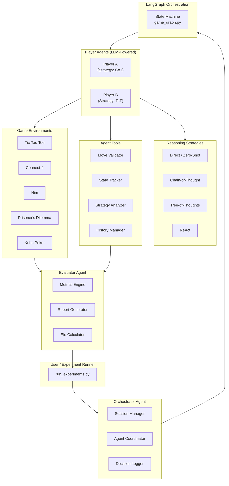
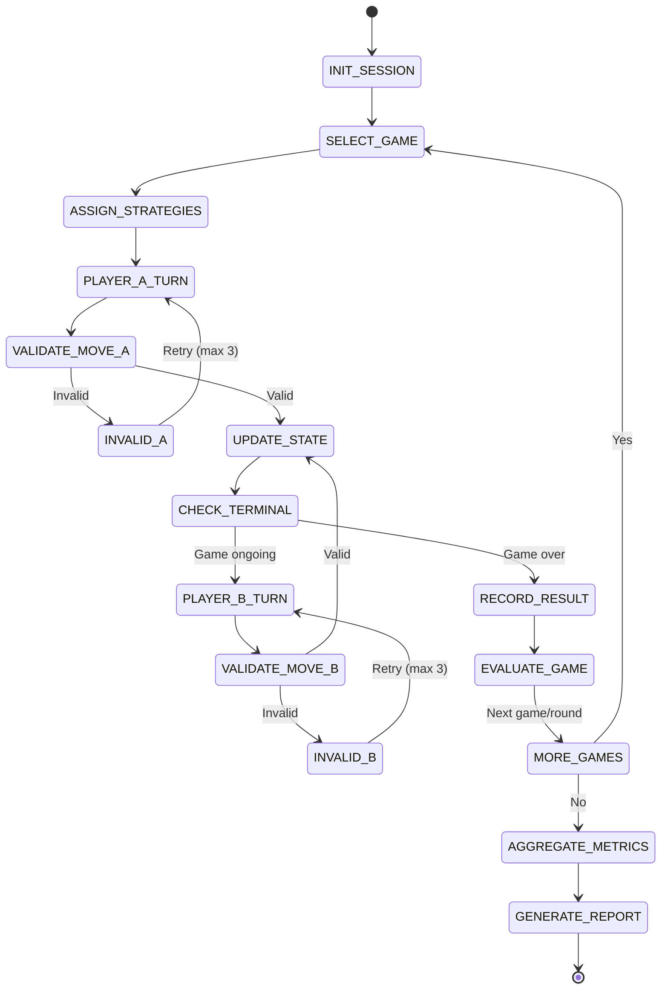

# Agentic GTBench: LLM Strategic Reasoning via Multi-Agent Game-Theoretic Evaluation

FAST-NUCES — Agentic AI Final Project
Manal Aamir (22I-1940) · Aqsa Fayaz (22i-1865) · Arhum Khan (22i-1967)
Department of Data Science

## Overview

GTBench proposed evaluating LLM strategic reasoning through game theory but stopped at reviewing prompting techniques on paper — it never built or tested an actual agent system. This project extends that idea into a working one: a multi-agent system where LLM agents play five classical games against each other, using four different reasoning strategies, coordinated end to end by an Orchestrator and scored by an Evaluator.

Everything runs through a LangGraph state machine, so a "match" is a real, replayable sequence of moves and validations rather than a single prompt-response pair.

## Repository Structure

```
agentic-gtbench/
├── agents/
│   ├── base_agent.py           # Abstract LLM agent interface
│   ├── player_agent.py         # Game-playing agent with strategy injection
│   ├── orchestrator_agent.py   # Session manager & coordinator
│   ├── evaluator_agent.py      # Metric collector & result analyzer
│   └── strategies/
│       ├── direct.py           # Zero-shot prompting
│       ├── cot.py              # Chain-of-Thought
│       ├── tot.py              # Tree-of-Thoughts
│       └── react.py            # ReAct (Reason + Act)
├── games/
│   ├── base_game.py            # Abstract game interface
│   ├── tictactoe.py            # Complete-info, deterministic
│   ├── connect4.py             # Complete-info, deterministic
│   ├── nim.py                  # Perfect-info combinatorial
│   ├── prisoners_dilemma.py    # Repeated / iterated game
│   └── kuhn_poker.py           # Incomplete-info, probabilistic
├── tools/
│   ├── move_validator.py       # Legal move enforcement tool
│   ├── state_tracker.py        # Game state serialization tool
│   ├── strategy_analyzer.py    # Opponent modeling tool
│   └── history_manager.py      # Persistent game history tool
├── orchestration/
│   └── game_graph.py           # LangGraph workflow definition
├── evaluation/
│   ├── metrics.py              # Win rate, invalid rate, Elo, Pareto
│   └── reporter.py             # CSV/JSON/HTML result export
├── experiments/
│   ├── run_experiments.py      # Main experiment runner
│   └── configs/
│       ├── exp1_reasoning.yaml         # Strategy comparison (same model, vary strategy)
│       ├── exp2_models.yaml            # Model comparison via OpenRouter slugs
│       ├── exp3_gemma_openrouter.yaml  # Gemma 12B vs Gemma 3n (OpenRouter)
│       └── exp4_gemma_12b_vs_27b.yaml  # Gemma 12B vs 27B head-to-head
├── config/
│   └── settings.py             # Central config & env loading
├── tests/
│   ├── test_games.py
│   ├── test_agents.py
│   └── test_evaluation.py
├── diagrams/
│   ├── system_architecture.md  # Mermaid: full system diagram
│   └── agent_workflow.md       # Mermaid: LangGraph state flow
├── results/                    # Auto-generated experiment outputs
├── requirements.txt
├── .env.example
└── IMPLEMENTATION_PLAN.md      # Step-by-step dev guide for Cursor
```

## System Architecture



## LangGraph State Flow



## What This Adds Beyond the GTBench Paper

| Gap in the review paper | What we built instead |
|---|---|
| No actual agent implementation | Full LangGraph multi-agent system |
| Reviews prompting techniques, doesn't test them | Live head-to-head strategy tournaments |
| No tool use / API integration | Four dedicated agent tools |
| No multi-agent coordination | Orchestrator, Player, and Evaluator agents working together |
| No evaluation framework | Elo ratings, win rates, invalid-move rate, Pareto efficiency |
| No dynamic or adaptive behavior | Opponent modeling via the Strategy Analyzer tool |
| No persistence or memory | History Manager with JSON logs |
| Single reasoning path | All four strategies selectable per agent |

## Setup

**Prerequisites**
- Python 3.10+
- An OpenRouter API key (recommended — one key covers OpenAI-, Meta-, and Google-routed models), or direct OpenAI/Groq keys if your configs point at those providers instead
- Git

**1. Clone the repository**
```bash
git clone https://github.com/Aqsa-Fayaz/Agentic-gtbench.git
cd Agentic-gtbench
```

**2. Create a virtual environment**
```bash
python -m venv venv
source venv/bin/activate        # Linux/Mac
venv\Scripts\activate           # Windows
```

**3. Install dependencies**
```bash
pip install -r requirements.txt
```

**4. Configure environment variables**
```bash
cp .env.example .env
# add your API keys to .env
```

**5. Run the test suite**
```bash
python -m pytest tests/ -v
```

**6. Run an experiment**
```bash
# Strategy comparison
python experiments/run_experiments.py --config experiments/configs/exp1_reasoning.yaml

# Model comparison (OpenRouter model IDs, e.g. openai/gpt-4o, meta-llama/...)
python experiments/run_experiments.py --config experiments/configs/exp2_models.yaml

# Gemma on OpenRouter
python experiments/run_experiments.py --config experiments/configs/exp3_gemma_openrouter.yaml

# Gemma 12B vs 27B
python experiments/run_experiments.py --config experiments/configs/exp4_gemma_12b_vs_27b.yaml
```

Each run writes to `results/<ExperimentName>_<timestamp>/` as `report.json`, `sessions.csv`, and `report.html`. To view the HTML report locally:

```bash
cd results/<your_run_folder>
python -m http.server 8000
# open http://127.0.0.1:8000/report.html
```

**On LangGraph recursion limits:** the runner raises `recursion_limit` on `graph.invoke()` so longer games — iterated Prisoner's Dilemma in particular — can finish without hitting the default step cap.

**On reading win rates correctly:** `report.json` aggregates win rate by *strategy name*. That's fine for strategy-comparison runs, but for model-vs-model runs where both players use the same strategy (e.g. both `cot`), strategy-keyed aggregates will conflate the two models. For those runs, compute win rates directly from `sessions.csv` using `winner` against `player_a_id` / `player_b_id` so each model gets credited correctly.

## Evaluation Metrics

| Metric | Description | Applies to |
|---|---|---|
| Win Rate | Share of games won, per agent/strategy | All games |
| Invalid Move Rate | Share of illegal moves generated | All games |
| Elo Rating | Relative strength across the full tournament | All games |
| Avg. Turns to Win | Efficiency of reasoning | Tic-Tac-Toe, Connect-4, Nim |
| Cooperation Rate | Share of cooperative choices | Prisoner's Dilemma |
| Pareto Efficiency | Closeness to the optimal joint payoff | Prisoner's Dilemma |
| Bluff Detection Rate | Accuracy of opponent modeling | Kuhn Poker |

## Experiments

**Experiment 1 — Reasoning strategy comparison**
GPT-4o-mini against itself, varying only the reasoning strategy (Direct, CoT, ToT, ReAct), across all five games at 20 rounds each. Hypothesis: CoT and ToT help in probabilistic games like Kuhn Poker, and may actually hurt in fully deterministic ones like Tic-Tac-Toe, where extra deliberation doesn't change the optimal move.

**Experiment 2 — Model family comparison**
`openai/gpt-4o` vs `openai/gpt-3.5-turbo` vs `meta-llama/llama-3-8b-instruct`, all routed through OpenRouter (`provider: openrouter` in the YAML), all using CoT. Run on Tic-Tac-Toe, Prisoner's Dilemma, and Kuhn Poker — see `exp2_models.yaml`. Hypothesis: stronger models pull further ahead in payoff-driven and incomplete-information games than in simple deterministic ones.

**Experiments 3 & 4 — Gemma matchups (OpenRouter)**
- exp3: `google/gemma-3-12b-it` vs `google/gemma-3n-e2b-it:free` — the free-tier model may hit provider rate limits.
- exp4: `google/gemma-3-12b-it` vs `google/gemma-3-27b-it`, fixed CoT, 5 rounds × 3 games (15 sessions) in the default config.

## NCEAC Complex Computing Requirements

- [x] Autonomous agents — Player, Orchestrator, and Evaluator
- [x] Decision-making under uncertainty — Kuhn Poker, Prisoner's Dilemma
- [x] Tool usage — four custom tools (validator, tracker, analyzer, history)
- [x] Multi-agent coordination — LangGraph orchestration with message passing
- [x] Dynamic, unpredictable operation — opponents adapt based on game history
- [x] Research and experimentation — multiple YAML configs with automated metrics export
- [x] Ethics discussion — see paper, Section IX

## License

MIT License — for academic use only.
