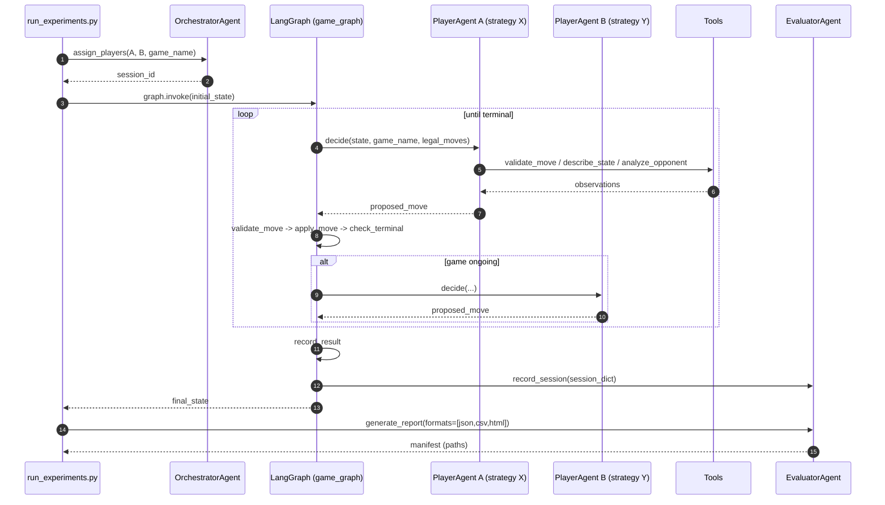
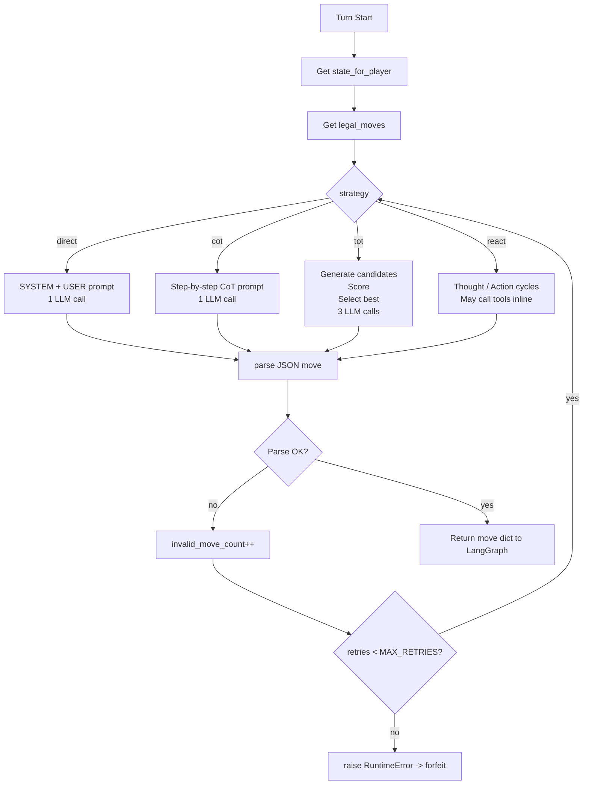
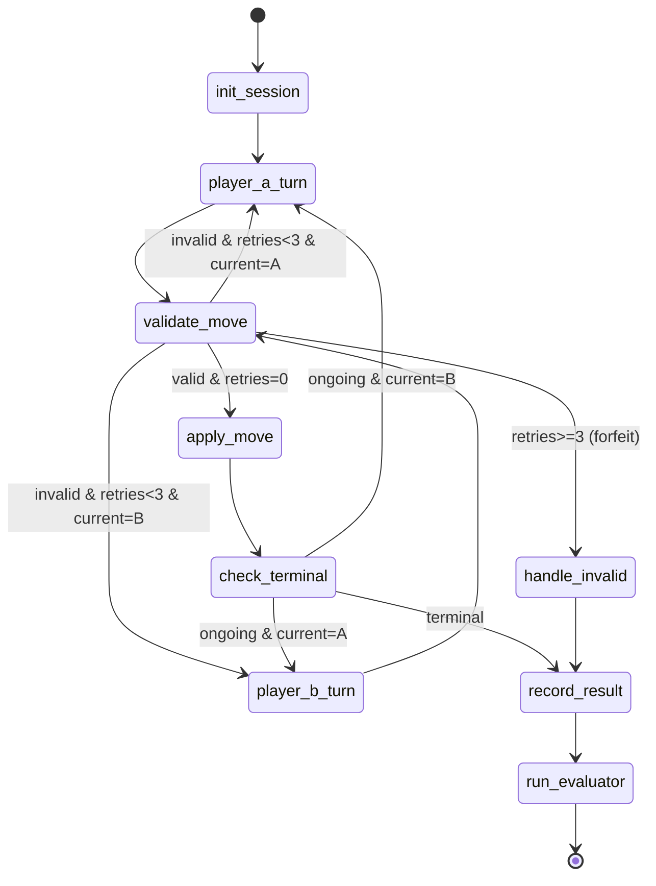
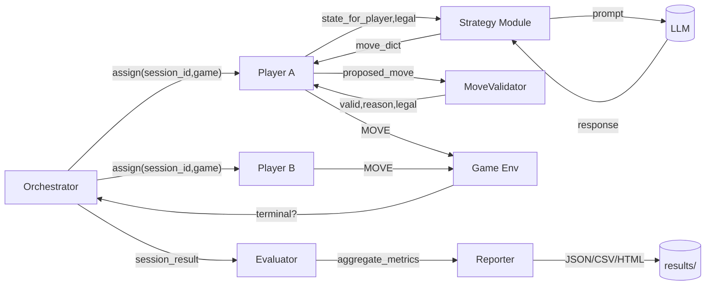

# Agent Workflow Diagrams

## 1. End-to-End Session Sequence

```mermaid
sequenceDiagram
    autonumber
    participant R as run_experiments.py
    participant O as OrchestratorAgent
    participant G as LangGraph (game_graph)
    participant A as PlayerAgent A (strategy X)
    participant B as PlayerAgent B (strategy Y)
    participant T as Tools
    participant E as EvaluatorAgent

    R->>O: assign_players(A, B, game_name)
    O-->>R: session_id
    R->>G: graph.invoke(initial_state)

    loop until terminal
        G->>A: decide(state, game_name, legal_moves)
        A->>T: validate_move / describe_state / analyze_opponent
        T-->>A: observations
        A-->>G: proposed_move
        G->>G: validate_move -> apply_move -> check_terminal
        alt game ongoing
            G->>B: decide(...)
            B-->>G: proposed_move
        end
    end

    G->>G: record_result
    G->>E: record_session(session_dict)
    G-->>R: final_state
    R->>E: generate_report(formats=[json,csv,html])
    E-->>R: manifest (paths)
```

## 2. PlayerAgent Decision Pipeline

```mermaid
flowchart TD
    A[Turn Start] --> B[Get state_for_player]
    B --> C[Get legal_moves]
    C --> D{strategy}

    D -->|direct| E1[SYSTEM + USER prompt\n1 LLM call]
    D -->|cot| E2[Step-by-step CoT prompt\n1 LLM call]
    D -->|tot| E3[Generate candidates\nScore\nSelect best\n3 LLM calls]
    D -->|react| E4[Thought / Action cycles\nMay call tools inline]

    E1 --> F[parse JSON move]
    E2 --> F
    E3 --> F
    E4 --> F

    F --> G{Parse OK?}
    G -- no --> H[invalid_move_count++]
    H --> I{retries < MAX_RETRIES?}
    I -- yes --> D
    I -- no --> J[raise RuntimeError -> forfeit]

    G -- yes --> K[Return move dict to LangGraph]
```

## 3. LangGraph State Transitions

```mermaid
stateDiagram-v2
    [*] --> init_session
    init_session --> player_a_turn

    player_a_turn --> validate_move
    player_b_turn --> validate_move

    validate_move --> apply_move : valid & retries=0
    validate_move --> player_a_turn : invalid & retries<3 & current=A
    validate_move --> player_b_turn : invalid & retries<3 & current=B
    validate_move --> handle_invalid : retries>=3 (forfeit)

    apply_move --> check_terminal
    check_terminal --> player_b_turn : ongoing & current=A
    check_terminal --> player_a_turn : ongoing & current=B
    check_terminal --> record_result : terminal

    handle_invalid --> record_result
    record_result --> run_evaluator
    run_evaluator --> [*]
```

## 4. Multi-Agent Message Flow

```mermaid
graph LR
    O[Orchestrator] -- assign(session_id,game) --> PA[Player A]
    O -- assign(session_id,game) --> PB[Player B]

    PA -- state_for_player,legal --> S[Strategy Module]
    S -- prompt --> L1[(LLM)]
    L1 -- response --> S
    S -- move_dict --> PA

    PA -- proposed_move --> MV[MoveValidator]
    MV -- valid,reason,legal --> PA

    PA -- MOVE --> G[Game Env]
    PB -- MOVE --> G
    G -- terminal? --> O
    O -- session_result --> EV[Evaluator]
    EV -- aggregate_metrics --> R[Reporter]
    R -- JSON/CSV/HTML --> FS[(results/)]
```
