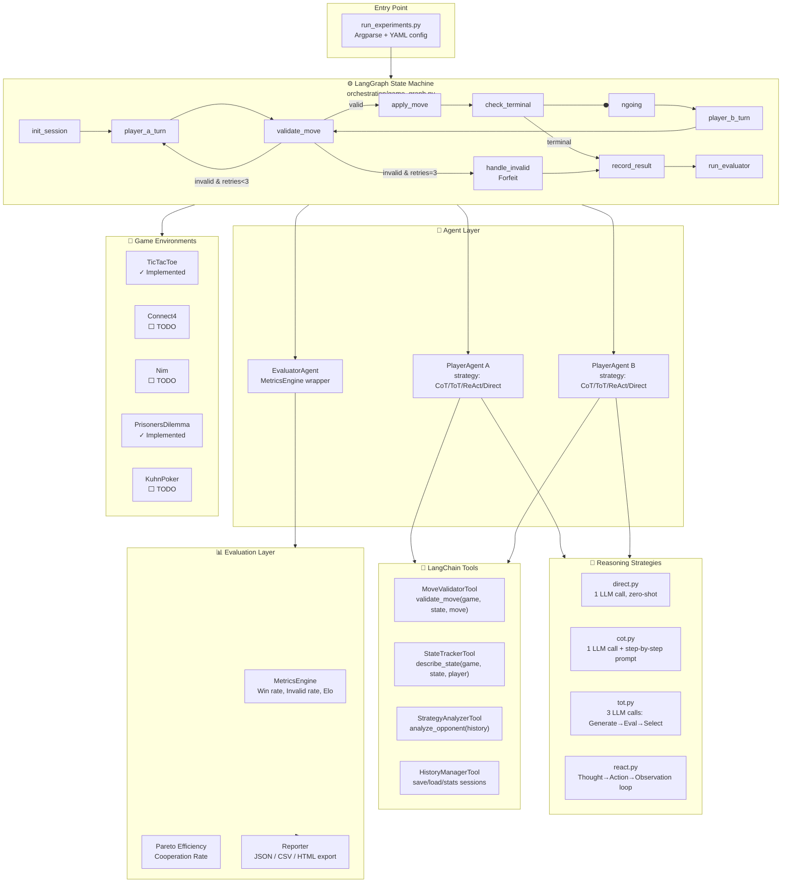
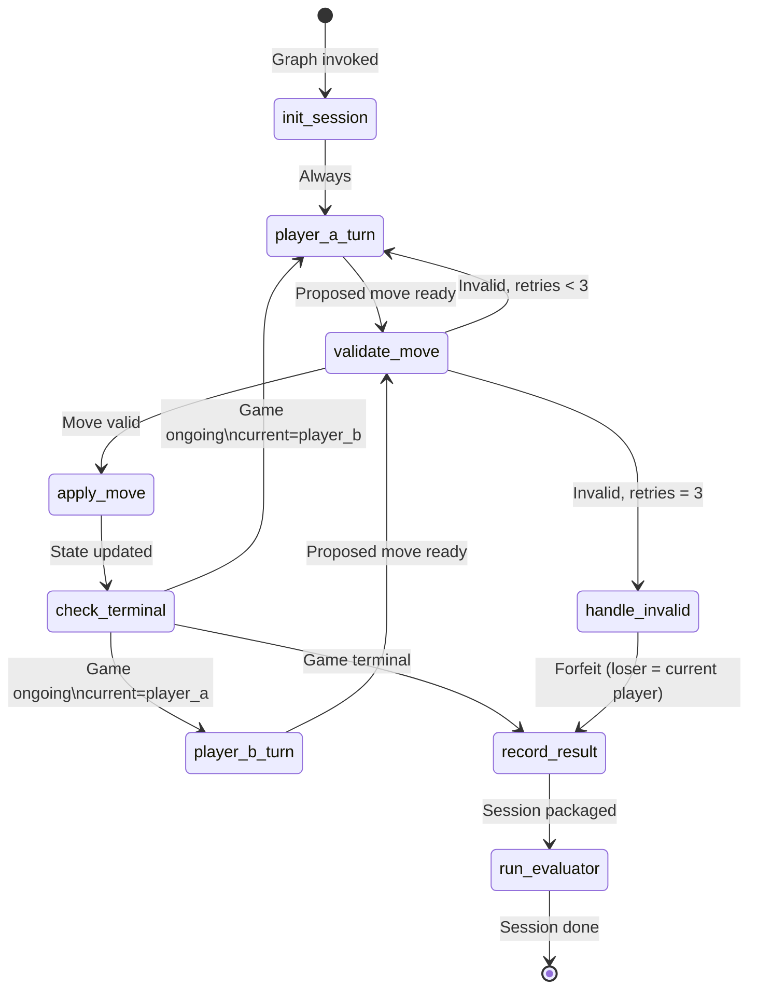
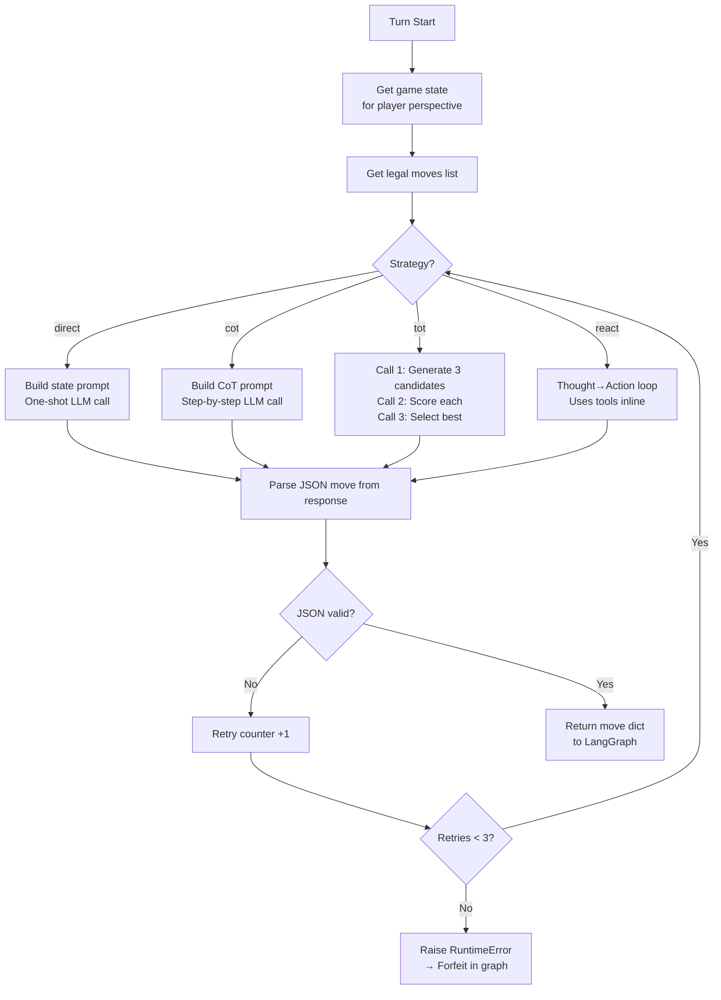
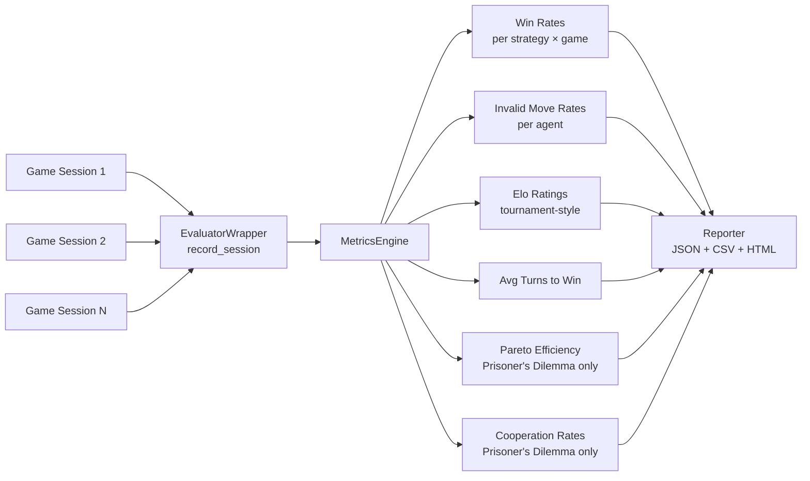
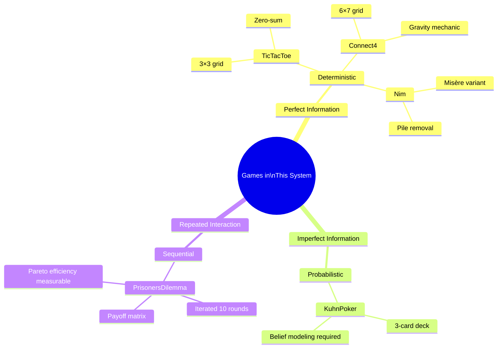

# System Architecture Diagrams

## 1. Full System Architecture

---

## 2. LangGraph State Machine (Detailed)

---

## 3. Agent Decision Flow (PlayerAgent)

---

## 4. Evaluation Pipeline

---

## 5. Game Taxonomy (from GTBench)

